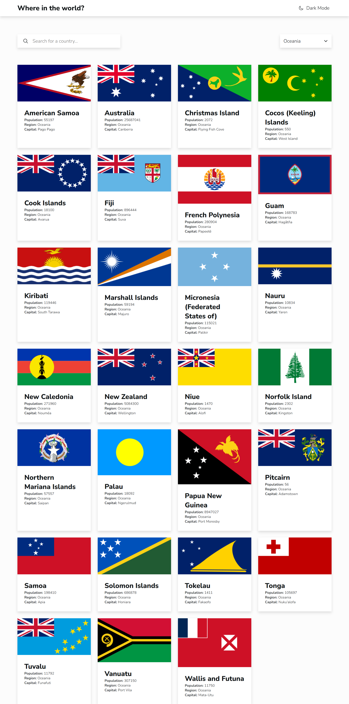

# Frontend Mentor - REST Countries API with color theme switcher solution

This is a solution to the [REST Countries API with color theme switcher challenge on Frontend Mentor](https://www.frontendmentor.io/challenges/rest-countries-api-with-color-theme-switcher-5cacc469fec04111f7b848ca). Frontend Mentor challenges help you improve your coding skills by building realistic projects. 

## Table of contents

- [Overview](#overview)
  - [The challenge](#the-challenge)
  - [Screenshot](#screenshot)
  - [Links](#links)
- [My process](#my-process)
  - [Built with](#built-with)
  - [What I learned](#what-i-learned)
  - [Continued development](#continued-development)
  - [Useful resources](#useful-resources)
- [Author](#author)
- [Acknowledgments](#acknowledgments)

## Overview

### The challenge

Users should be able to:

- See all countries from the API on the homepage
- Search for a country using an input field
- Filter countries by region
- Click on a country to see more detailed information on a separate page
- Click through to the border countries on the detail page
- Toggle the color scheme between light and dark mode

### Screenshot

### Links

- Solution URL: [Github](https://github.com/ghalihbageur/rest-countries-api-with-color-theme-switcher-master)
- Live Site URL: [My Site](https://ghalihbageur.github.io/rest-countries-api-with-color-theme-switcher-master/)

## My process

### Built with

- Semantic HTML5 markup
- CSS Custom Properties (Variables)
- Flexbox and CSS Grid
- React JS Library
- React Router for Navigation
- Context API for State Management

### What I learned

This project was a significant milestone for me as it marked my first time building a complete application using React. Here are the key takeaways from my learning journey:

1. Learning React for the First Time: This project introduced me to the core concepts of React, such as Component-Based Architecture, Props, and State Management. I learned how to break down a complex UI into reusable pieces and manage data flow using Hooks like useState and useEffect.

2. Global State with Context API: I learned how to avoid "prop drilling" by using the Context API to share the country data across different components, making the data accessible to both the Home page and the Detail page efficiently.

3. Responsive Grid Layouts: I explored modern CSS Grid techniques, specifically using the auto-fill and minmax functions. This allowed me to create a card layout that automatically wraps and fills the screen width on mobile devices without relying on multiple media queries.

4. URL Encoding and Navigation: I gained experience in handling dynamic routing with React Router. I learned how to decode URL parameters to ensure that countries with spaces or special characters in their names are correctly identified and displayed on the detail page.

5. Web Accessibility (ARIA): I practiced making my application more inclusive by implementing ARIA (Accessible Rich Internet Applications) attributes. I learned that providing clear aria-labels on search inputs is crucial for users who rely on screen readers.

### Continued development

In future projects, I plan to focus on:
- Implementing Fuzzy Search to handle user typos more gracefully.
- Exploring Skeleton Loading screens to improve the perceived performance during API data fetching.
- Diving deeper into React performance optimization using useMemo and useCallback.

### Useful resources

- React Documentation - The official docs were essential for understanding the component lifecycle and hooks.

## Author

- Github - [@ghalihbageur](https://github.com/ghalihbageur/)
- Linkedin - [Ghalih Bageur](https://www.linkedin.com/in/ghalihbageur/)
- Frontend Mentor - [@ghalihbageur](https://www.frontendmentor.io/profile/yourusername)

## Acknowledgments

I would like to thank the developer community for providing insights into handling asynchronous data rendering and for the guidance on implementing professional UI patterns in React.